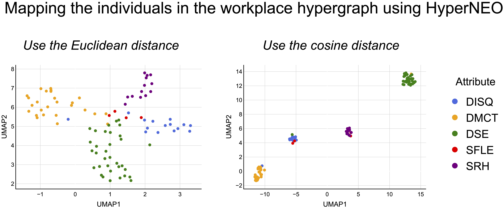

<h1 align="center">
HyperNEO    
<i>A mixed-membership stochastic block model for hypergraphs with node attributes</i>
</h1>

<i>Inferring community structure in attributed hypergraphs</i>

*HyperNEO* is a statistical framework for incorporating node attribute data into the learning of community structure in a hypergraph, employing a stochastic block model [1].
The name 'HyperNEO' comes from our message that *'Node attribute data can Enhance the learning of Overlapping community structure in Hypergraphs.'*

I provide code for the HyperNEO in Python.

# Requirements
I confirmed that the code runs in Python 3.9.0.
See requirements.txt for the libraries used in our code.

# Setup

(1) Clone this repository:

	git clone git@github.com:kazuibasou/hyperneo.git

(2) Run the command at `hyperneo/`:

	mkdir data figs

# Construction of data sets

Use four empirical attributed hypergraphs publicly available.

## workplace and hospital data

(1) Download `preprocessed_real_data.zip` in the data set [2] and unzip it.

(2) Find the files `workspace1.npz`, `workspace1_meta.csv`, `hospital.npz`, and `hospital_meta.csv` in the unzipped folder.

(3) Make folders named `workplace` and `hospital` in the folder `hyperneo/data/`.

(4) Put the files `workspace1.npz` and `workspace1_meta.csv` in the folder `hyperneo/data/workplace/`.

(5) Put the files `hospital.npz` and `hospital_meta.csv` in the folder `hyperneo/data/hospital/`.

## high-school data

Download `contact-high-school.zip` in the data set [3] and unzip it in the folder `hyperneo/data/`.

## primary-school data

Download `contact-primary-school.zip` in the data set [4] and unzip it in the folder `hyperneo/data/`.

This generates the following structure of the directory.

	hyperneo/data/
	├ contact-high-school/
	├ contact-primary-school/
	├ hospital/
	└ workplace/

# Inference of community structure

## Quick run

Run the following command at `hyperneo/`:

	python3 main.py

Perform inference of community structure in the workplace hypergraph by default. 
Uncomment any one of lines 7--10 in `hyperneo/main.py` to change the data set.

The figures visualizing inferred community structure in the given hypergraph will be saved in `hyperneo/figs/`.

## More details

See `hyperneo/hyperneo.ipynb` for more details.

# Reference

[1] Kazuki Nakajima and Takeaki Uno. Inferring community structure in attributed hypergraphs using stochastic block models. 2024. [<a href="https://arxiv.org/abs/2401.00688">arXiv</a>].

[2] Nicolo Ruggeri, 2023, "Real and Synthetic data for Hypergraph Benchmarking (processed for the Hy-MMSBM generative model)", [<a href="https://doi.org/10.17617/3.HRW0OE">link</a>], Edmond, V1.

[3] Austin R. Benson. contact-high-school dataset (labeled). [<a href="https://www.cs.cornell.edu/~arb/data/contact-high-school-labeled/">link</a>].

[4] Austin R. Benson. contact-primary-school dataset (labeled). [<a href="https://www.cs.cornell.edu/~arb/data/contact-primary-school-labeled/">link</a>].

# License

This source code is released under the MIT License, see LICENSE.txt.

# Contact
- Kazuki Nakajima (https://kazuibasou.github.io)
- nakajima@tmu.ac.jp
