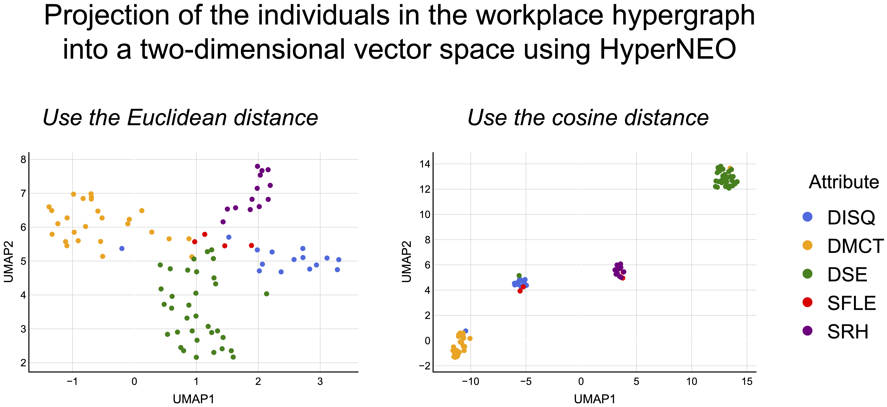

<h1 align="center">
HyperNEO    
<i>Inference and Visualization of Community Structure in Attributed Hypergraphs Using Mixed-Membership Stochastic Block Models</i>
</h1>

This repository provides a framework, *HyperNEO*, that combines mixed-membership stochastic block models for hypergraphs with dimensionality reduction methods [[paper]](https://link.springer.com/article/10.1007/s13278-025-01440-z).

I provide code for the HyperNEO in Python.

If you use this code, please cite

- [Kazuki Nakajima, Takeaki Uno. Inference and Visualization of Community Structure in Attributed Hypergraphs Using Mixed-Membership Stochastic Block Models. *Social Network Analysis and Mining*. Vol. 15, Article No. 5 (2025).](https://link.springer.com/article/10.1007/s13278-025-01440-z)

# Requirements
I confirmed that the code runs in Python 3.9.0.
See requirements.txt for the libraries used in our code.

# Setup

(1) Clone this repository:

	git clone git@github.com:kazuibasou/hyperneo.git

(2) Run the command at `hyperneo/`:

	mkdir data figs

# Construction of data sets

Use four empirical attributed hypergraphs publicly available.

## workplace, hospital, house-committees, and senate-committees data

(1) Download `preprocessed_real_data.zip` in the data set [1] and unzip it.

(2) Find the files `workspace1.npz`, `workspace1_meta.csv`, `hospital.npz`, `hospital_meta.csv`, `house-committees.npz`, `house-committees_meta.csv`, `senate-committees.npz`, and `senate-committees_meta.csv` in the unzipped folder.

(3) Make folders named `workplace`, `hospital`, `house-committees`, and `senate-committees` in the folder `hyperneo/data/`.

(4) Put the files `workspace1.npz` and `workspace1_meta.csv` in the folder `hyperneo/data/workplace/`.

(5) Put the files `hospital.npz` and `hospital_meta.csv` in the folder `hyperneo/data/hospital/`.

(6) Put the files `house-committees.npz` and `house-committees_meta.csv` in the folder `hyperneo/data/house-committees/`.

(7) Put the files `senate-committees.npz` and `senate-committees_meta.csv` in the folder `hyperneo/data/senate-committees/`.

## high-school data

Download `contact-high-school.zip` in the data set [2] and unzip it in the folder `hyperneo/data/`.

## primary-school data

Download `contact-primary-school.zip` in the data set [3] and unzip it in the folder `hyperneo/data/`.

This generates the following structure of the directory.

	hyperneo/data/
	├ contact-high-school/
	├ contact-primary-school/
	├ hospital/
	├ house-committees/
	├ senate-committees/
	└ workplace/

# Inference and visualization of community structure

See `hyperneo/hyperneo.ipynb` for more details.

# Reference

[1] Nicolo Ruggeri, 2023, "Real and Synthetic data for Hypergraph Benchmarking (processed for the Hy-MMSBM generative model)", [<a href="https://doi.org/10.17617/3.HRW0OE">link</a>], Edmond, V1.

[2] Austin R. Benson. contact-high-school dataset (labeled). [<a href="https://www.cs.cornell.edu/~arb/data/contact-high-school-labeled/">link</a>].

[3] Austin R. Benson. contact-primary-school dataset (labeled). [<a href="https://www.cs.cornell.edu/~arb/data/contact-primary-school-labeled/">link</a>].

# License

This source code is released under the MIT License, see LICENSE.txt.

# Contact
- Kazuki Nakajima (https://kazuibasou.github.io)
- nakajima@tmu.ac.jp
